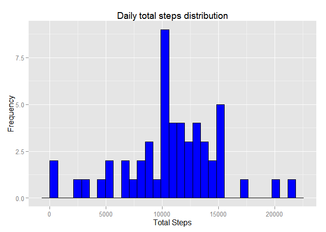
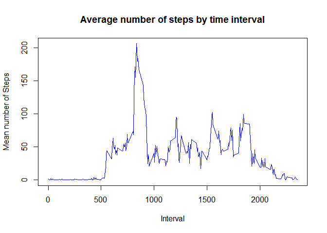
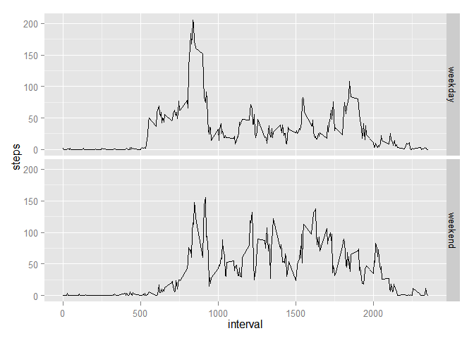

# Reproducible Research: Peer Assessment 1

This assignment makes use of data from a personal activity monitoring device. This device collects data at 5 minute intervals through out the day. The data consists of two months of data from an anonymous individual collected during the months of October and November, 2012 and include the number of steps taken in 5 minute intervals each day.

## Loading and preprocessing the data
I start by loading the data.


```r
activity = read.csv("activity.csv")
```

The variables included in this dataset are: 

* steps: Number of steps taking in a 5-minute interval (missing values are
coded as NA) 
* date: The date on which the measurement was taken in YYYY-MM-DD
format
* interval: Identifier for the 5-minute interval in which measurement was taken

The data contains several NA values in the step column. For preliminary analysis, 
we extract a clean subset of the data without missing values:


```r
clean_activity = activity[complete.cases(activity),]
```

## What is mean total number of steps taken per day?

I extract the total of the steps grouped by date and plot the histogram:


```r
library(plyr)
library(ggplot2)
totalByDay <- ddply(clean_activity,~date,summarise,total=sum(steps))
ggplot(totalByDay, aes(x=total)) + geom_histogram(colour="black", fill="blue") +
    ggtitle("Daily total steps distribution") +xlab("Total Steps")+ylab("Frequency")
```

```
## stat_bin: binwidth defaulted to range/30. Use 'binwidth = x' to adjust this.
```

 

Here, I compute the mean and median, which turn out to be pretty close:

```r
mean(totalByDay$total)
```

```
## [1] 10766
```

```r
median(totalByDay$total)
```

```
## [1] 10765
```


## What is the average daily activity pattern?

In this part, I examine the average number of steps taken on each 5 minute interval. Note that I also calculate the median, which I plan to use later.


```r
byInterval <- ddply(clean_activity,~interval,summarise,mean=mean(steps), median=median(steps))
plot(byInterval$interval, byInterval$mean, type="l", main="Average number of steps by time interval", xlab="Interval", ylab="Mean number of Steps", col="blue")
```

 


I observe that the maximum activity occurs at interval 835:


```r
byInterval[which.max(byInterval$mean),]
```

```
##     interval  mean median
## 104      835 206.2     19
```
## Imputing missing values

Now, I go back to deal with the missing values:


```r
sum(is.na(activity$steps) ) 
```

```
## [1] 2304
```

The  missing values can be imputed by some sort of aggregation. Since all the values for the first day are missing, an aggregation by day will still not manage to provide values for all the data. Therefore I opted to use an aggregation by interval. I chose the median over the average since it is an integer rather then a floating point value.

This function uses the median by interval, computed earlier, to fill in any missing values.


```r
imputeMissing <- function(df, byInterval) {
    for (i in 1:nrow(df)) {
        row = df[i,]
        if (is.na(row$steps)) {
            steps = byInterval[byInterval$interval == row$interval,]$median
            df[i,]$steps <- steps
        }
    }
    return(df)
}
```


```r
imputed <- imputeMissing(activity,byInterval)
head(imputed)
```

```
##   steps       date interval
## 1     0 2012-10-01        0
## 2     0 2012-10-01        5
## 3     0 2012-10-01       10
## 4     0 2012-10-01       15
## 5     0 2012-10-01       20
## 6     0 2012-10-01       25
```

## Are there differences in activity patterns between weekdays and weekends?

For this step, I use the complete data set with the imputed data from the last step. I intruduce two new calculated variables:

* weekDay: The day of the week for the date
* datType: a factor with the levels (weekday, weekend)

The following code pupulates these fields

```r
imputed$weekDay = weekdays(as.Date(imputed$date))

getDayType <- function(x) {
  if (x == 'Sunday' | x == 'Saturday')
    type<- "weekend"
  else
    type <- "weekday"
  type
}

imputed$dayType <- as.factor(sapply(imputed$weekDay, getDayType))
```

I rely on ggplot to do the summarization by day accross each day type:


```r
require(ggplot2)
ggplot(imputed, aes(x=interval, y=steps)) + stat_summary(fun.y="mean", geom="line")+facet_grid(dayType~.)
```

 

